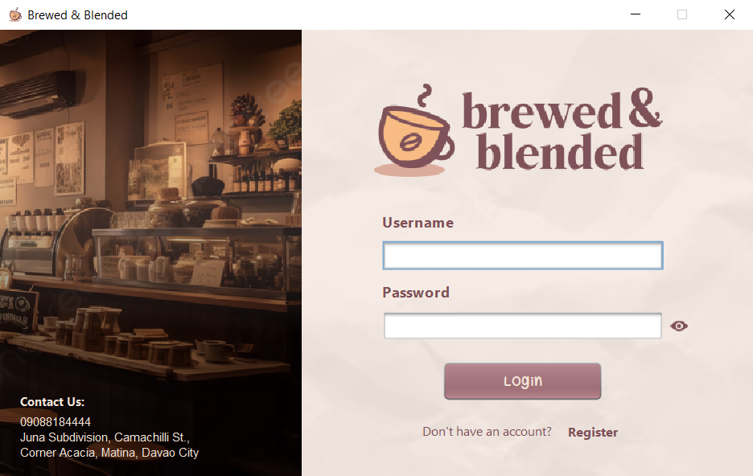
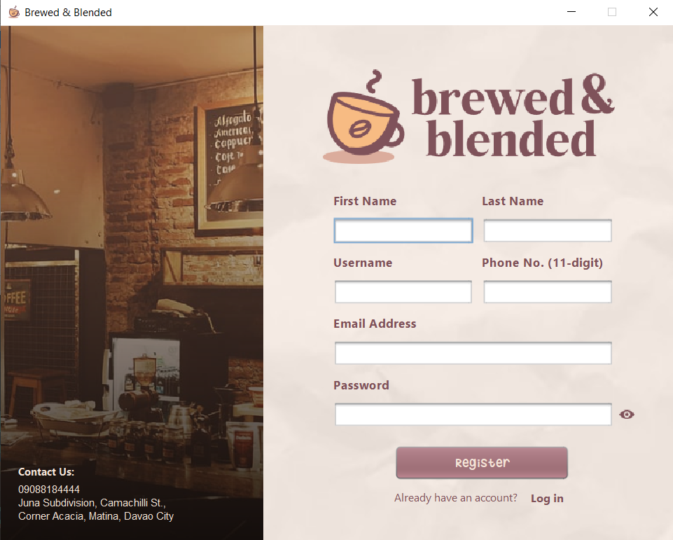
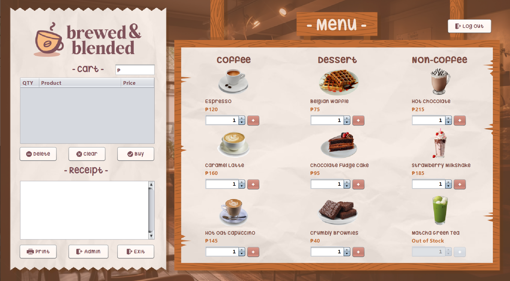
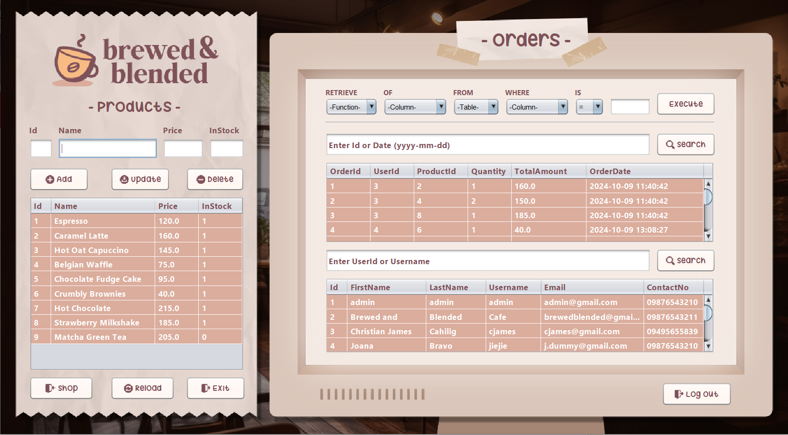

# ☕ Brewed & Blended

### Java-Based Café Ordering and Transaction Management System

Brewed & Blended is a desktop-based café ordering system developed using Java Swing, JDBC, and MySQL. The application was designed to streamline order processing, transaction management, and receipt generation while providing a user-friendly experience for both customers and staff.

## Overview

This project was developed as part of my academic journey in software development and database management. The goal was to create a digital ordering solution that simplifies café operations and improves service efficiency through an intuitive graphical interface.

## Features

- Product browsing and selection
- Shopping cart functionality
- Order management
- Receipt generation
- Transaction processing
- MySQL database integration
- User-friendly graphical interface

## Technologies Used

- Java
- Java Swing
- JDBC
- MySQL
- XAMPP
- NetBeans IDE
- FlatLaf

## Project Structure

```text
src/            Source code
database/       SQL database file
screenshots/    Application screenshots
lib/            External dependencies
```

## Database Setup

1. Start Apache and MySQL using XAMPP.
2. Open phpMyAdmin.
3. Create a new database.
4. Import the SQL file located in:

```text
database/brewedblended_db.sql
```

5. Update the database connection settings if necessary.

## Running the Project

1. Clone this repository.
2. Open the project in NetBeans.
3. Ensure the required libraries are available.
4. Start MySQL through XAMPP.
5. Run the application.

## Screenshots

### Main Interface




### Ordering Screen



### Admin Screen



## Future Improvements

- User authentication and role management
- Sales analytics dashboard
- Inventory management integration
- Online ordering support
- Enhanced reporting features

## Contributors

This project was developed as a group project.

### Team Members

- Christian James Cahilig
- Bai Fatima Andong
- Karylle Mish Gellica
- Jan Loren Odiong
- John Llorie Sarmiento

## Learnings Outcomes

- Object-Oriented Programming (OOP)
- Java GUI Development
- Database Design and Management
- JDBC Integration
- Event-Driven Programming
- Software Development Lifecycle
